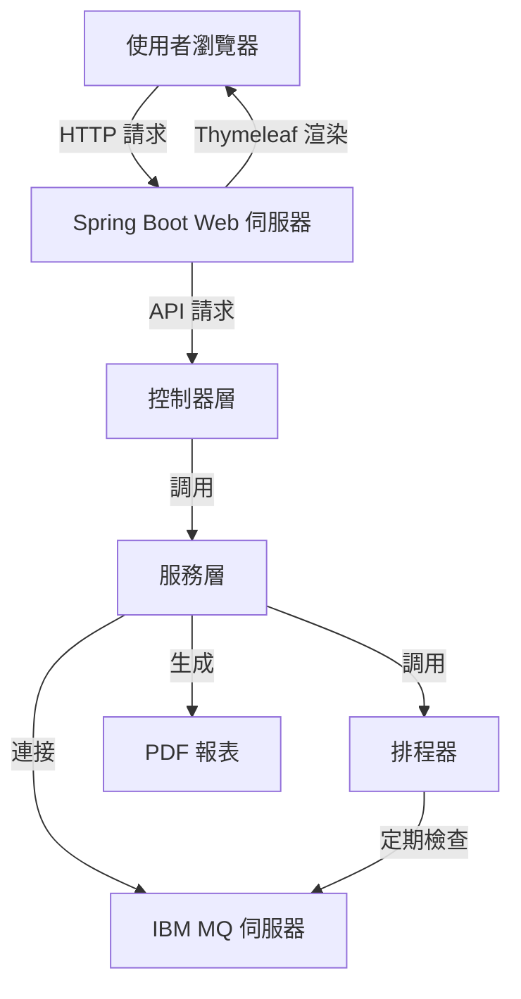
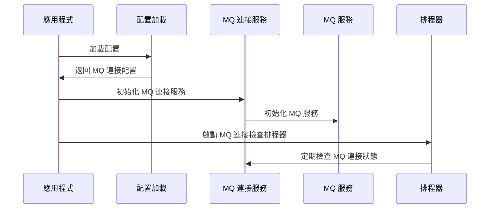
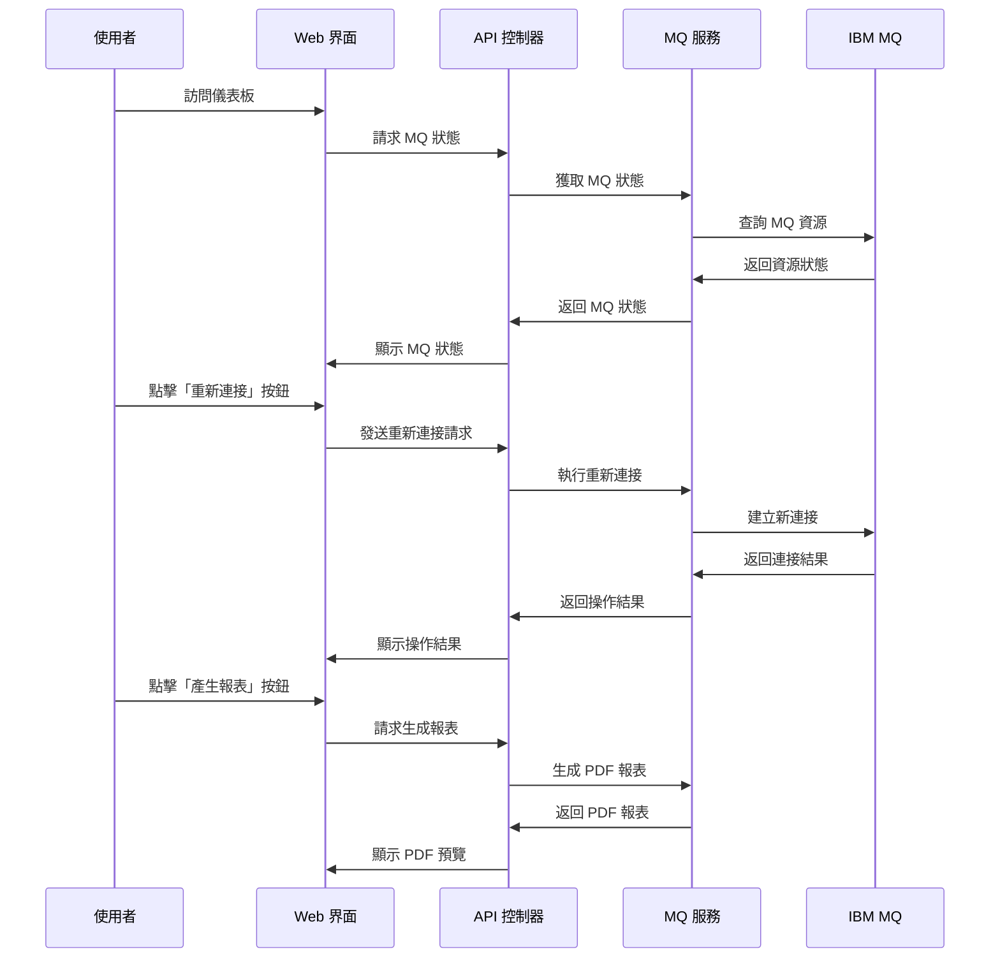
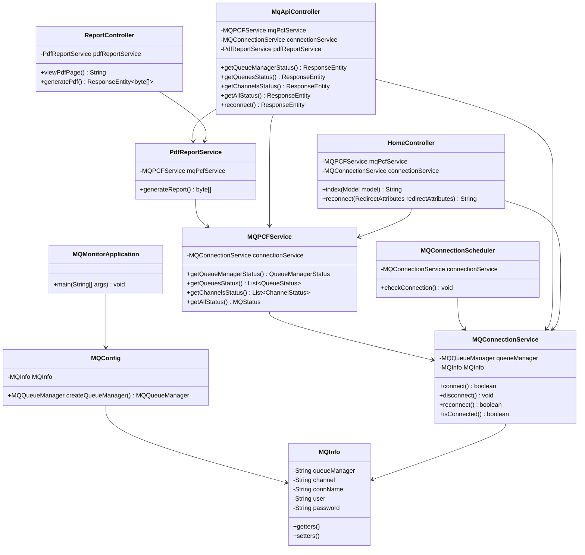
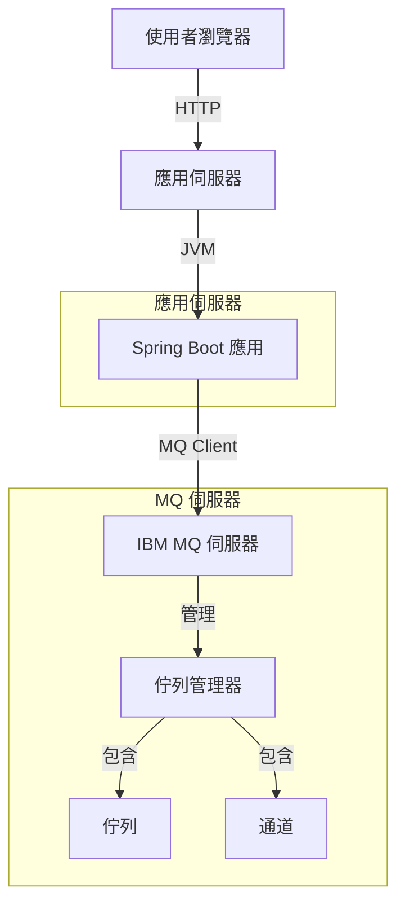

# MQ Monitor 系統規格文件

## 1. 專案概述

MQ Monitor 是一個用於監控 IBM MQ 佇列管理器、佇列和通道狀態的 Web 應用程式。它提供了直觀的儀表板和 RESTful API，讓使用者能夠即時監控 MQ 資源的運行狀況。系統具備自動和手動重新連線功能，確保在 MQ 連線斷開時能夠快速恢復連線。

## 2. 系統架構

### 2.1 技術架構

- **後端**：
  - Java 21
  - Spring Boot 3.4.5
  - IBM MQ Java Client 9.3.4.0
  - PCF (Programmable Command Format) API
  - Spring Scheduling (用於自動重新連線)
  - Lombok
  - Apache Commons Lang3
  - Thymeleaf 模板引擎

- **前端**：
  - Thymeleaf 模板引擎
  - Bootstrap 5
  - JavaScript
  - PDF.js (用於 PDF 報表預覽)

### 2.2 系統架構圖

## 3. 功能需求

### 3.1 主要功能

1. **佇列管理器監控**：
   - 顯示佇列管理器的連接狀態
   - 顯示佇列管理器的啟動時間
   - 顯示佇列管理器的名稱

2. **佇列監控**：
   - 顯示所有佇列的深度
   - 顯示佇列的使用率
   - 顯示佇列的連接數

3. **通道監控**：
   - 顯示所有通道的狀態
   - 顯示通道的活動情況

4. **自動重新整理**：
   - 支援可配置的自動重新整理間隔
   - 提供倒數計時器

5. **自動重新連線**：
   - 當 MQ 連線斷開時，系統會自動嘗試重新連線
   - 定期檢查 MQ 連線狀態

6. **手動重新連線**：
   - 提供 Web 界面按鈕，允許手動觸發重新連線
   - 提供 API 端點，允許程式化觸發重新連線

7. **報表生成**：
   - 生成 PDF 格式的 MQ 狀態報表
   - 提供報表預覽功能

8. **RESTful API**：
   - 提供完整的 API 介面，方便與其他系統整合

### 3.2 非功能需求

1. **響應式設計**：
   - 適應不同螢幕尺寸的裝置
   - 使用 Bootstrap 5 實現響應式佈局

2. **性能需求**：
   - 頁面載入時間不超過 3 秒
   - API 響應時間不超過 1 秒

3. **安全需求**：
   - 支援 MQ 連接的用戶名和密碼認證
   - 敏感資訊不在前端顯示

## 4. 系統流程

### 4.1 系統啟動流程

### 4.2 用戶操作流程

## 5. 資料模型

### 5.1 類別關係圖

## 6. API 規格

### 6.1 RESTful API 端點

| 端點                   | 方法 | 描述                   | 回應格式 |
| ---------------------- | ---- | ---------------------- | -------- |
| `/api/mq/queuemanager` | GET  | 獲取佇列管理器狀態     | JSON     |
| `/api/mq/queues`       | GET  | 獲取所有佇列狀態       | JSON     |
| `/api/mq/channels`     | GET  | 獲取所有通道狀態       | JSON     |
| `/api/mq/status`       | GET  | 獲取所有 MQ 資源的狀態 | JSON     |
| `/api/mq/reconnect`    | POST | 手動觸發重新連接到 MQ  | JSON     |
| `/report/generate`     | GET  | 生成 PDF 報表          | PDF      |

### 6.2 Web 頁面

| 路徑      | 描述             | 模板            |
| --------- | ---------------- | --------------- |
| `/`       | 主儀表板頁面     | index.html      |
| `/report` | PDF 報表預覽頁面 | pdf-viewer.html |

## 7. 部署架構

## 8. 安全考量

1. **認證**：
   - 支援 IBM MQ 的用戶名和密碼認證
   - 配置文件中的密碼應該加密或使用環境變數

2. **授權**：
   - 確保 MQ 用戶具有適當的權限來監控佇列和通道

3. **資料保護**：
   - 敏感資訊不應在前端顯示
   - 考慮使用 HTTPS 保護資料傳輸

## 9. 測試策略

1. **單元測試**：
   - 測試各個服務類的功能
   - 使用 JUnit 和 Mockito 進行測試

2. **整合測試**：
   - 測試與 IBM MQ 的整合
   - 測試 API 端點的功能

3. **UI 測試**：
   - 測試 Web 界面的功能
   - 測試響應式設計

4. **性能測試**：
   - 測試系統在高負載下的性能
   - 測試自動重新連線功能的可靠性
